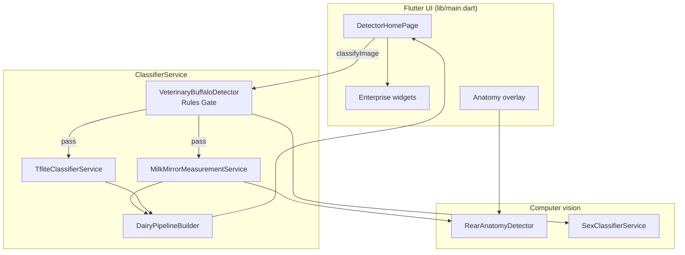
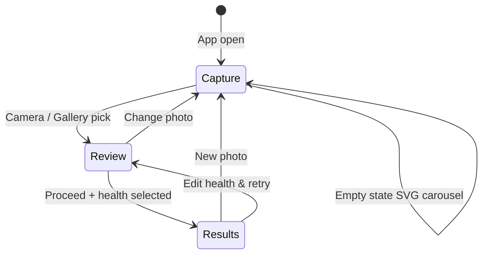
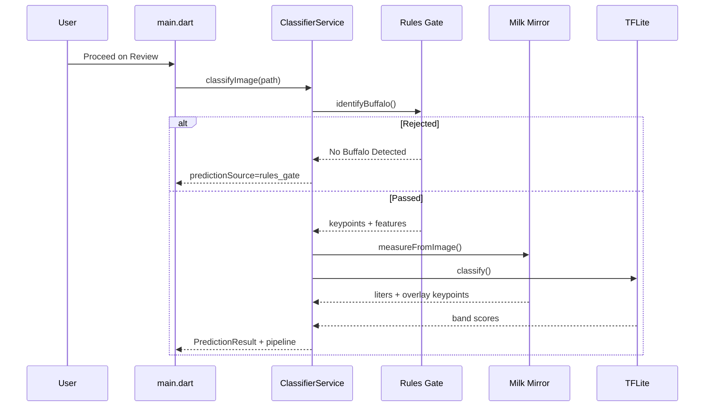
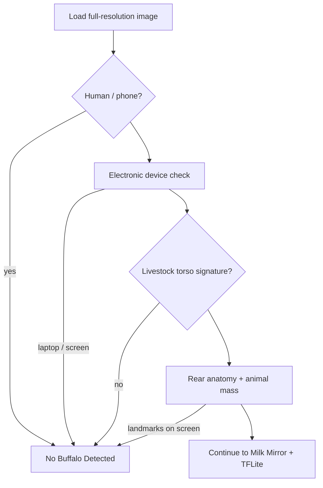

# Milk Mirror — AI Dairy Analytics

**Milk Mirror** is a Flutter app that analyzes **rear udder photos** of buffalo to estimate daily milk production, using a rules-based veterinary gate, geometric **Milk Mirror** measurement (pin bones + escutcheon), and an on-device **TFLite** band classifier.

---

## Table of contents

- [Features](#features)
- [Architecture overview](#architecture-overview)
- [User flow (3 stages)](#user-flow-3-stages)
- [Inference pipeline](#inference-pipeline)
- [Rules gate (non-buffalo rejection)](#rules-gate-non-buffalo-rejection)
- [Project structure](#project-structure)
- [Key dependencies](#key-dependencies)
- [Assets & models](#assets--models)
- [Getting started](#getting-started)
- [Build notes](#build-notes)
- [Testing](#testing)
- [Recent modifications](#recent-modifications)
- [Related documentation](#related-documentation)

---

## Features

| Area | Description |
|------|-------------|
| **3-stage UX** | Capture → Review (health + Proceed) → Results |
| **Rules gate** | Rejects humans, laptops/screens, phones, and non-farm scenes before AI runs |
| **Milk Mirror** | Pin bones (L/R), escutcheon A–D, area/symmetry → liters/day (1–30 L) |
| **TFLite** | 5-class band check (`6_lit` … `10_lit`) on 224×224 input |
| **Enterprise UI** | Purple SaaS theme, glass cards, AI dashboard, animated SVG showcase |
| **Overlays** | Anatomy landmarks aligned to photo in results view |
| **Firebase** | Optional Firestore (admin training app under `lib/admin/`) |

---

## Architecture overview



---

## User flow (3 stages)



| Stage | User action | Code entry |
|-------|-------------|------------|
| **1. Capture** | Pick image (camera/gallery) | `_pickImage()` → `_flowStage = review` |
| **2. Review** | Choose Healthy / Not healthy, tap **Proceed** | `_runPrediction()` |
| **3. Results** | View liters, overlay, dashboard | `_flowStage = results` |

---

## Inference pipeline



**Production liters:** Primary source is **Milk Mirror** geometry when measurement succeeds; TFLite refines when confidence is high. Display is clamped to **1–30 L** via `MilkProductionScale`.

---

## Rules gate (non-buffalo rejection)

The gate runs **before** Milk Mirror and TFLite. It cannot be skipped by anatomy fast-path for humans or devices.



| Check | Purpose |
|-------|---------|
| Human / selfie | Skin, face-like regions, portrait layout |
| Phone in hand | Skin + screen-like center region |
| **Silver laptop + dark IDE** | Neutral metal + dark UI + syntax colors |
| Black bezel + LCD | Classic laptop/monitor layout |
| Livestock signature | Organic hide/grass in central torso band (not floor only) |
| Landmark on device | Pin/udder points sampled on screen pixels |

Implementation: `VeterinaryBuffaloDetector` in `lib/services/classifier_service_new.dart`.

---

## Project structure

```
Image_detector/
├── lib/
│   ├── main.dart                          # App entry, 3-stage UI, prediction orchestration
│   ├── firebase_options.dart              # Firebase platform config
│   ├── config/
│   │   └── app_flags.dart                 # Feature flags
│   ├── theme/
│   │   └── app_theme.dart                 # Purple enterprise theme
│   ├── models/
│   │   ├── dairy_pipeline_report.dart     # Results dashboard model
│   │   └── training_sample.dart           # Admin training sample
│   ├── services/
│   │   ├── classifier_service_new.dart    # Orchestrator + rules gate
│   │   ├── tflite_classifier_service.dart # TFLite load/infer
│   │   ├── milk_mirror_measurement_service.dart
│   │   ├── rear_anatomy_detector.dart     # Pin/udder landmarks
│   │   ├── milk_mirror_calibration.dart
│   │   ├── milk_production_scale.dart     # 1–30 L display clamp
│   │   ├── dairy_pipeline_builder.dart    # UI pipeline report
│   │   ├── sex_classifier_service.dart
│   │   ├── image_based_milk_calculator.dart
│   │   └── inference_logger.dart          # Debug proof logging
│   ├── widgets/
│   │   ├── anatomy_overlay_layer.dart
│   │   ├── anatomy_overlay_painter.dart
│   │   └── enterprise/                    # Capture zone, dashboard, carousel
│   └── admin/                             # Separate admin entry (Firebase)
├── assets/
│   ├── model/
│   │   ├── model.tflite
│   │   ├── milk_mirror_calibration.json
│   │   └── training_metadata.json
│   └── labels/labels.txt
├── test/
│   ├── buffalo_gate_test.dart             # Rules gate unit tests
│   ├── fixtures/user_laptop.png           # Regression: laptop reject
│   └── ...
├── training/                              # Python train/export scripts
├── android/app/proguard-rules.pro         # Release TFLite/R8 rules
└── docs/
    ├── EXECUTION_FLOW.md                  # File-to-file trigger map
    └── MILK_MIRROR_SPEC.md
```

---

## Key dependencies

| Package | Use |
|---------|-----|
| `tflite_flutter` | On-device inference |
| `image` / `image_picker` | Decode & pick photos |
| `firebase_core` / `cloud_firestore` | Optional backend |
| `flutter_svg` / `flutter_animate` / `smooth_page_indicator` | Showcase carousel |
| `google_fonts` | Typography |

---

## Assets & models

| Asset | Role |
|-------|------|
| `assets/model/model.tflite` | 5-class liter band classifier |
| `assets/labels/labels.txt` | Class names (`6_lit` … `10_lit`) |
| `assets/model/milk_mirror_calibration.json` | Escutcheon → liters coefficients |
| `assets/model/training_metadata.json` | Val accuracy, trained flag |

Retrain: `training/train_all.ps1` → copies `model.tflite` into `assets/model/`.

---

## Getting started

### Prerequisites

- Flutter SDK 3.11+ (`sdk: ^3.11.4`)
- For Android release: JDK 17, Android SDK

### Run (debug)

```powershell
cd c:\Users\vinod\Image_detector
flutter pub get
flutter run
```

### Run (release on device)

```powershell
flutter clean
flutter pub get
flutter run --release
```

After rules-gate changes, use a **full reinstall** (not hot reload).

---

## Build notes

### Android release (R8 / TFLite)

Release builds minify native/Java deps. `android/app/proguard-rules.pro` keeps TensorFlow Lite classes and suppresses optional GPU delegate warnings. `android/app/build.gradle.kts` pins `tensorflow-lite` 2.11.0 aligned with `tflite_flutter`.

### Windows

Camera picker is disabled on Windows desktop; use **Gallery** only.

---

## Testing

```powershell
flutter test test/buffalo_gate_test.dart
flutter test test/tflite_pipeline_smoke_test.dart
```

Covers: real buffalo pass, human/selfie/laptop reject, synthetic desk laptop, flat gray screen.

`tflite_pipeline_smoke_test.dart` verifies end-to-end model load + classify flow and prints pipeline diagnostics in terminal logs.

---

## Recent modifications

| Change | Files |
|--------|--------|
| **3-stage flow** (capture / review / results) | `lib/main.dart` |
| **Non-buffalo gate** (human, laptop, silver MacBook + IDE, livestock signature) | `lib/services/classifier_service_new.dart` |
| **Anatomy fast-path** no longer skips human checks | `classifier_service_new.dart` |
| **Template anatomy** excluded from fast-path | `rear_anatomy_detector.dart` (`isTemplateFallback`) |
| **Single production figure** (1–30 L, no class probability bars) | `enterprise_ai_dashboard.dart`, `milk_production_scale.dart` |
| **SVG showcase carousel** (empty capture state) | `dairy_ai_showcase_carousel.dart`, `dairy_showcase_svgs.dart` |
| **Android release ProGuard** for TFLite | `android/app/proguard-rules.pro` |
| **Gate tests** + user laptop fixture | `test/buffalo_gate_test.dart`, `test/fixtures/` |
| **TFLite smoke test** (headless synthetic image pipeline check) | `test/tflite_pipeline_smoke_test.dart` |
| **Deployment isolation branch created** | `deployment` branch (same baseline as `main` before new deploy-only work) |

---

## Related documentation

| Document | Contents |
|----------|----------|
| [docs/EXECUTION_FLOW.md](docs/EXECUTION_FLOW.md) | App open → every file/function call map |
| [docs/MILK_MIRROR_SPEC.md](docs/MILK_MIRROR_SPEC.md) | Product spec vs implementation |
| [PROJECT_PROPOSAL.md](PROJECT_PROPOSAL.md) | Original project proposal |

---

## License

Private / educational project — see repository owner for usage terms.
