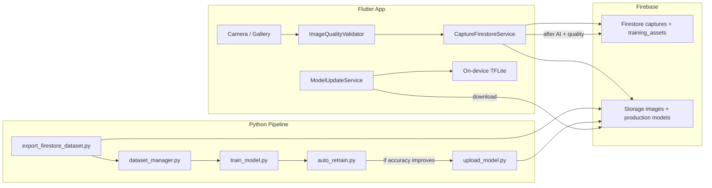

# Continuous Learning — Implementation Guide

Production-grade self-improving pipeline for **Milk Mirror** (Flutter + on-device TFLite).

See also: **[MULTI_STAGE_PIPELINE.md](MULTI_STAGE_PIPELINE.md)** for the 5-stage validation architecture (quality → animal → angle → udder → milk).

## Architecture



## Folder structure

```
training/
  config/retrain_config.json      # thresholds (300 samples, min accuracy, etc.)
  data/
    raw_pool/{6_lit,...}/         # exported images before split
    export_manifest.json          # dedupe exported doc ids
    retrain_log.jsonl             # audit log
  datasets/
    train/ val/ test/             # built by dataset_manager.py
  output/
    model.tflite                  # production candidate
    model_candidate.tflite        # A/B before deploy
    confusion_matrix.png
    training_metadata.json
  export_firestore_dataset.py
  dataset_manager.py
  train_model.py
  auto_retrain.py
  upload_model.py
  hard_example_mining.py
  image_quality.py

lib/
  services/image_quality_validator.dart
  services/capture_firestore_service.dart
  services/model_update_service.dart
  services/content_hash_service.dart
  config/continuous_learning_config.dart
```

## Step-by-step setup

### 1. Firebase Console

1. Enable **Firestore** and **Storage**.
2. Create a **service account** key (Project Settings → Service accounts → Generate key).
3. Set environment variable:
   ```bash
   export GOOGLE_APPLICATION_CREDENTIALS="/path/to/serviceAccount.json"
   export FIREBASE_STORAGE_BUCKET="buffalomilk-aada6.firebasestorage.app"
   ```
4. Deploy rules (optional):
   ```bash
   firebase deploy --only firestore:rules,storage
   ```

### 2. Flutter app

```bash
cd Image_detector
flutter pub get
flutter run
```

On each capture:

- Image → **Firebase Storage** (`captures/{id}/original.jpg`)
- Metadata → **Firestore** (`captures/{id}`)
- Quality score computed on-device
- After successful AI + quality → **training_assets/{label}/samples/{id}`**

### 3. Python environment

```bash
cd training
python3 -m venv .venv
source .venv/bin/activate
pip install -r requirements.txt
```

### 4. Manual retrain (first time)

```bash
python export_firestore_dataset.py
python dataset_manager.py
python train_model.py
```

### 5. Automatic retrain (production)

```bash
python auto_retrain.py
```

Runs only when `pendingTrainingCount >= 300` (configurable) or `--force`.

**Smart replacement:** deploys new model only if `val_accuracy` improves by ≥2% and ≥45% absolute.

### 6. Scheduled retrain (cron / GitHub Actions)

```bash
# Daily at 2 AM
0 2 * * * cd /path/to/Image_detector/training && .venv/bin/python auto_retrain.py
```

Or set `"schedule_daily": true` in `retrain_config.json`.

### 7. App receives new model

After `upload_model.py`:

- Files at `models/production/*` in Storage
- `ml_pipeline/state` updated with `modelVersion`
- App downloads on next launch via `ModelUpdateService`
- Inference stays **on-device** (`Interpreter.fromFile`)

## Configuration (`training/config/retrain_config.json`)

| Key | Default | Meaning |
|-----|---------|---------|
| `min_new_samples_for_retrain` | 300 | Wait until enough new validated samples |
| `min_val_accuracy_to_deploy` | 0.45 | Do not ship worse models |
| `min_val_accuracy_improvement` | 0.02 | Must beat previous by 2% |
| `max_samples_per_class` | 800 | Cap class size |
| `incremental_learning` | true | Continue from `output/saved_model` |

## Accuracy improvements checklist

- [ ] Collect 500+ rear-udder photos per liter band
- [ ] Verify farmer-reported liters for labels
- [ ] Run `hard_example_mining.py` and manually correct labels
- [ ] Review `output/confusion_matrix.png` after each retrain
- [ ] Keep `merge_local_assets: true` for seed data
- [ ] Field-test MAE in liters (not only val_accuracy)

## Monitoring

- Firestore: `ml_pipeline/state` → `pendingTrainingCount`, `valAccuracy`, `modelVersion`
- Log file: `training/data/retrain_log.jsonl`
- Flutter debug: `[CAPTURE]`, `[MODEL]` log lines

## Security (production)

Replace open rules in `firestore.rules` / `storage.rules` with Firebase Auth:

- Farmers: write own `captures/{id}`
- Training pipeline: service account only for `models/production` writes

## Troubleshooting

| Issue | Fix |
|-------|-----|
| Export fails | Set `GOOGLE_APPLICATION_CREDENTIALS` |
| Retrain skipped | Need 300+ samples or `python auto_retrain.py --force` |
| Model not updating in app | Check Storage paths + `ml_pipeline/state.modelVersion` |
| Low val accuracy | More data, balance classes, review hard examples |
