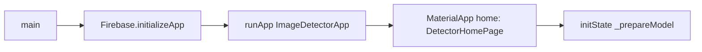
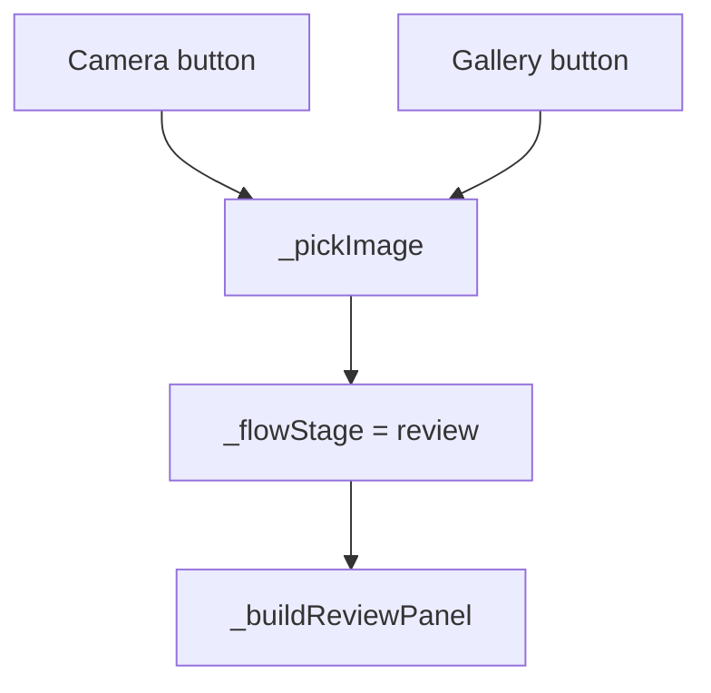
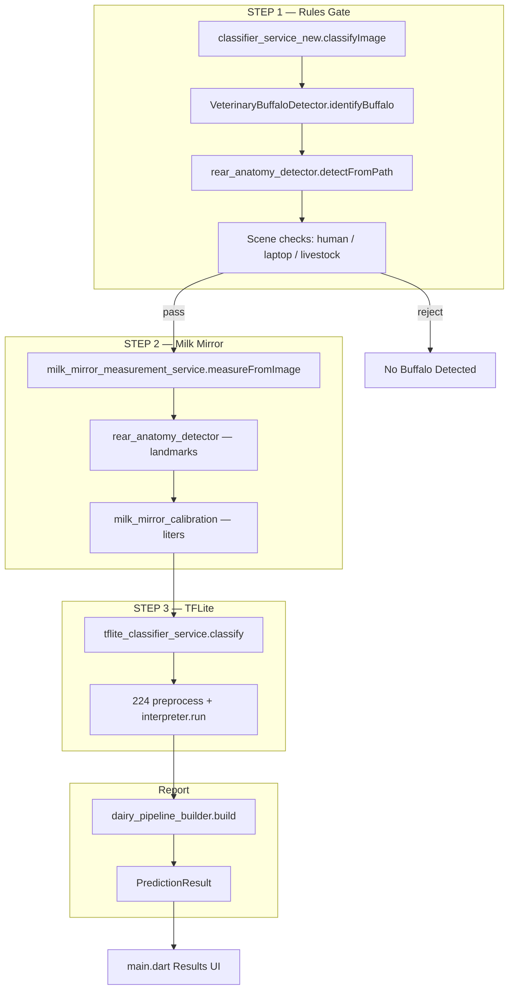
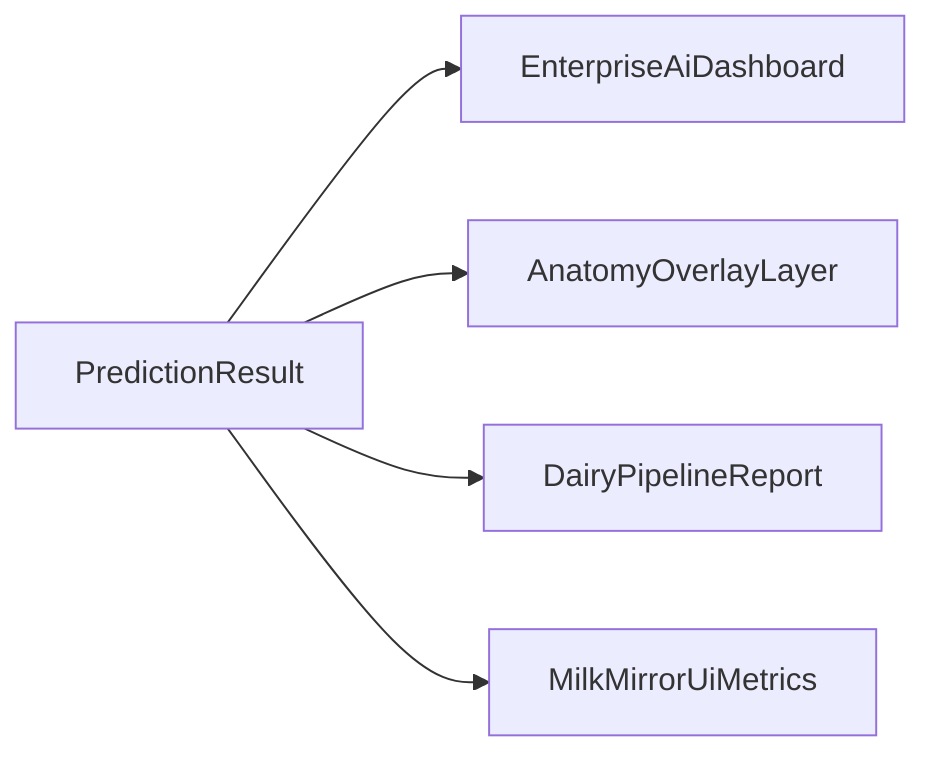
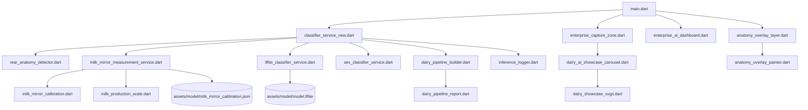

# Milk Mirror — Execution Flow & File Trigger Map

This document traces **what runs from app launch** through each user action, which **files** are involved, and the **purpose** of each module.

---

## 1. Application bootstrap

| Step | File | Function | Purpose |
|------|------|----------|---------|
| 1 | `lib/main.dart` | `main()` | Entry point; binds Flutter, initializes Firebase |
| 2 | `lib/firebase_options.dart` | `DefaultFirebaseOptions` | Platform Firebase keys |
| 3 | `lib/main.dart` | `ImageDetectorApp.build` | Applies `AppTheme`, sets home page |
| 4 | `lib/theme/app_theme.dart` | `AppTheme.build()` | Purple enterprise Material theme |
| 5 | `lib/main.dart` | `_DetectorHomePageState.initState` | Starts model load on first frame |
| 6 | `lib/main.dart` | `_prepareModel()` | Calls classifier init |
| 7 | `lib/services/classifier_service_new.dart` | `ClassifierService.loadModel()` | Loads calibration, TFLite, metadata |
| 8 | `lib/services/milk_mirror_measurement_service.dart` | `ensureCalibrationLoaded()` | Reads `milk_mirror_calibration.json` |
| 9 | `lib/services/tflite_classifier_service.dart` | `load()` | `Interpreter.fromAsset(model.tflite)` |
| 10 | `lib/services/inference_logger.dart` | `banner`, `log`, `proof` | Console proof trail |

**UI state after boot:** `_isModelReady` true/false, header shows **AI ONLINE** / loading.

---

## 2. Stage 1 — Capture (empty state)

| UI component | File | Purpose |
|--------------|------|---------|
| App header | `lib/widgets/enterprise/enterprise_app_header.dart` | Title, AI status pill |
| Capture zone | `lib/widgets/enterprise/enterprise_capture_zone.dart` | Photo area; empty vs image |
| SVG carousel | `lib/widgets/enterprise/dairy_ai_showcase_carousel.dart` | Auto-scrolling dairy AI showcase |
| SVG art | `lib/widgets/enterprise/dairy_showcase_svgs.dart` | Inline SVG strings (7 slides) |
| Layout | `lib/widgets/enterprise/responsive_layout.dart` | Breakpoints, capture aspect ratio |
| Glass card | `lib/widgets/enterprise/glass_card.dart` | Frosted card wrapper |

**User: Camera / Gallery**

| Step | File | Function | Purpose |
|------|------|----------|---------|
| 1 | `lib/main.dart` | `_pickImage(ImageSource)` | Opens `image_picker` |
| 2 | `lib/main.dart` | `setState` | Sets `_pickedImage`, `_flowStage = review`, default health |
| 3 | — | — | **No inference yet** — only file path stored |

---

## 3. Stage 2 — Review

| UI | File | Purpose |
|----|------|---------|
| Image preview | `lib/main.dart` → `EnterpriseCaptureZone` | Shows picked file |
| Health checkboxes | `lib/main.dart` `_healthCheckbox` | Mutually exclusive Healthy / Not healthy |
| Proceed | `lib/main.dart` `_runPrediction` | Starts inference |

**User: Proceed**

| Step | File | Function | Next |
|------|------|----------|------|
| 1 | `lib/main.dart` | `_runPrediction()` | Parallel tasks below |
| 2a | `lib/services/classifier_service_new.dart` | `classifyImage(path, …)` | Main pipeline |
| 2b | `lib/services/image_based_milk_calculator.dart` | `calculateMilkFromImage(path)` | Secondary heuristic (UI card) |

---

## 4. Stage 3 — Inference pipeline (`classifyImage`)

### 4.1 Rules gate detail (`VeterinaryBuffaloDetector`)

**File:** `lib/services/classifier_service_new.dart` (class `VeterinaryBuffaloDetector`)

| Order | Method | Purpose |
|-------|--------|---------|
| 1 | `_loadOrientedImage` | Decode + EXIF orientation |
| 2 | `RearAnatomyDetector().detectFromPath` | Pin/udder landmarks (`lib/services/rear_anatomy_detector.dart`) |
| 3 | `_nonBuffaloPhotoReason` | Human, phone, laptop/screen, livestock signature |
| 4 | `_landmarksOnDeviceSurface` | Reject if pins sit on laptop screen |
| 5 | `_detectObjects` (224px) | Human + organic animal presence |
| 6 | Anatomy fast-path OR fallback species/keypoints | Confidence + structure |
| 7 | `SexClassifierService` | Female vs bull (`lib/services/sex_classifier_service.dart`) |
| 8 | `_predictMilkProduction` | Heuristic liters hint for gate features |

**Reject output:** `BuffaloAnalysisResult.status = 'rejected'` → UI label **No Buffalo Detected**, `predictionSource = 'rules_gate'`, TFLite **not** run.

### 4.2 Milk Mirror

**File:** `lib/services/milk_mirror_measurement_service.dart`

| Call | Purpose |
|------|---------|
| `measureFromImage(path)` | Full pipeline for one photo |
| Uses `RearAnatomyDetector` | Normalized landmark coordinates |
| Uses calibration JSON | Maps escutcheon metrics → L/day |
| Returns `MilkMirrorResult` | Liters, confidence, keypoints for overlay |

**Supporting:** `lib/services/milk_mirror_calibration.dart`, `lib/services/milk_production_scale.dart`

### 4.3 TFLite

**File:** `lib/services/tflite_classifier_service.dart`

| Call | Purpose |
|------|---------|
| `classify(imagePath)` | Resize 224, normalize, `interpreter.run()` |
| Reads | `assets/labels/labels.txt` |
| Output | Band label, softmax scores, `expectedLiters` helper |

### 4.4 Merge & report

**File:** `lib/services/classifier_service_new.dart`

- Chooses primary liters (Milk Mirror vs TFLite vs blend).
- Builds `InferenceDiagnostics` via `inference_logger.dart`.
- Calls `DairyPipelineBuilder.build()` → `lib/models/dairy_pipeline_report.dart`.

---

## 5. Stage 3 — Results UI

| Step | File | Component | Purpose |
|------|------|-----------|---------|
| 1 | `lib/main.dart` | `setState` | `_flowStage = results`, store `PredictionResult` |
| 2 | `lib/main.dart` | `_reportWithUserHealth` | Patches pipeline health from review checkbox |
| 3 | `lib/widgets/enterprise/enterprise_ai_dashboard.dart` | Dashboard | Species, lactation, health, production hero |
| 4 | `lib/widgets/anatomy_overlay_layer.dart` | Overlay | Draws pins on image |
| 5 | `lib/widgets/anatomy_overlay_painter.dart` | Painter | Geometry for A, L/R pin, udder |
| 6 | `lib/widgets/enterprise/ai_analysis_overlay.dart` | Optional AI chrome | Scan effects |
| 7 | `lib/main.dart` | `_buildInferenceProofCard` | Debug diagnostics expansion |
| 8 | `lib/widgets/enterprise/enterprise_measurement_card.dart` | Measurements | Escutcheon H/W, area |

---

## 6. File purpose reference

### Entry & UI

| File | Purpose |
|------|---------|
| `lib/main.dart` | Single home screen: flow state machine, pick image, run prediction, build all stages |
| `lib/theme/app_theme.dart` | Colors, gradients, typography (`AppColors`, `AppTheme`) |
| `lib/config/app_flags.dart` | Compile-time / runtime flags |

### Services (business logic)

| File | Purpose |
|------|---------|
| `classifier_service_new.dart` | **Central orchestrator** + `VeterinaryBuffaloDetector` rules gate |
| `tflite_classifier_service.dart` | TFLite interpreter lifecycle and inference |
| `milk_mirror_measurement_service.dart` | Escutcheon geometry → liters |
| `rear_anatomy_detector.dart` | Torso silhouette, pin pair, udder, tail point |
| `milk_mirror_calibration.dart` | Load/applies regression coefficients |
| `milk_production_scale.dart` | Clamp/format 1–30 L display |
| `dairy_pipeline_builder.dart` | Builds infographic pipeline steps for UI |
| `sex_classifier_service.dart` | Pink tissue / udder hints → female vs bull |
| `image_based_milk_calculator.dart` | Separate visual heuristic (secondary card) |
| `inference_logger.dart` | Session IDs, proof logs, `InferenceDiagnostics` |

### Models (data)

| File | Purpose |
|------|---------|
| `dairy_pipeline_report.dart` | `DairyPipelineReport`, workflow steps, alerts |
| `training_sample.dart` | Admin training document shape |

### Widgets

| File | Purpose |
|------|---------|
| `enterprise_capture_zone.dart` | Camera preview / empty carousel / hint pill |
| `dairy_ai_showcase_carousel.dart` | PageView showcase animations |
| `dairy_showcase_svgs.dart` | SVG content for carousel |
| `enterprise_ai_dashboard.dart` | Results cards, production hero |
| `enterprise_app_header.dart` | Top bar branding |
| `enterprise_measurement_card.dart` | Milk mirror dimensions |
| `glass_card.dart` | Shared card chrome |
| `responsive_layout.dart` | Screen tier + dimensions |
| `anatomy_overlay_layer.dart` | Stack overlay on image |
| `anatomy_overlay_painter.dart` | CustomPaint landmarks |
| `ai_analysis_overlay.dart` | Supplemental AI visual effects |

### Admin (separate entry)

| File | Purpose |
|------|---------|
| `lib/admin/main_admin.dart` | Admin app entry point |
| `lib/admin/screens/admin_panel_screen.dart` | Training UI |
| `lib/admin/services/firebase_training_service.dart` | Firestore upload |

---

## 7. Trigger matrix (quick lookup)

| User / system event | Entry function | Primary files touched |
|---------------------|----------------|------------------------|
| App launch | `main()` | `main.dart`, `classifier_service_new.dart`, `tflite_classifier_service.dart` |
| Model ready UI | `_prepareModel` | `main.dart`, `enterprise_app_header.dart` |
| Tap Camera/Gallery | `_pickImage` | `main.dart`, `image_picker` |
| Empty capture UI | `build` capture stage | `enterprise_capture_zone.dart`, `dairy_ai_showcase_carousel.dart` |
| Tap Proceed | `_runPrediction` | `main.dart` → `classifier_service_new.dart` |
| Rules reject | `identifyBuffalo` | `classifier_service_new.dart`, `rear_anatomy_detector.dart` |
| Rules pass | `identifyBuffalo` → measure | `milk_mirror_measurement_service.dart`, `rear_anatomy_detector.dart` |
| TFLite run | `classify` | `tflite_classifier_service.dart` |
| Show results | `build` results stage | `enterprise_ai_dashboard.dart`, `anatomy_overlay_layer.dart` |
| New photo | `_resetToCapture` | `main.dart` |
| Edit health & retry | `_backToReview` + Proceed | `main.dart`, `_reportWithUserHealth` |

---

## 8. Data flow diagram (files only)

---

## 9. Prediction result fields (what UI reads)

| Field | Set by | Used for |
|-------|--------|----------|
| `label` | ClassifierService | Main liters string (e.g. `7.7 L/day`) |
| `estimatedLiters` | ClassifierService | Numeric liters |
| `confidence` | Milk Mirror / blend | Dashboard ring |
| `keypoints` | Milk Mirror / gate | Overlay positions |
| `predictionSource` | ClassifierService | `milk_mirror`, `tflite`, `rules_gate`, … |
| `pipeline` | DairyPipelineBuilder | Species, lactation, health cards |
| `milkMirror` | MilkMirrorResult | Measurement card |
| `diagnostics` | InferenceLogger | Debug proof panel |

---

## 10. Tests that guard the flow

| Test file | Guards |
|-----------|--------|
| `test/buffalo_gate_test.dart` | Rules gate pass/reject including `test/fixtures/user_laptop.png` |
| `test/rear_anatomy_batch_test.dart` | Landmark stability |
| `test/milk_production_scale_test.dart` | Liter clamp/format |
| `test/sex_classifier_test.dart` | Sex classifier |
| `test/tflite_pipeline_smoke_test.dart` | TFLite load smoke |

---

## 11. When to read which doc

| Question | Read |
|----------|------|
| How do I run/build? | [README.md](../README.md) |
| What file runs after Proceed? | This document §4 |
| What should Milk Mirror measure? | [MILK_MIRROR_SPEC.md](MILK_MIRROR_SPEC.md) |
| Why was laptop accepted before? | README §Rules gate + `buffalo_gate_test.dart` |

---

*Last updated: reflects 3-stage UX, non-buffalo gate (human + laptop/IDE), SVG showcase, Milk Mirror primary display, and Android release ProGuard.*
